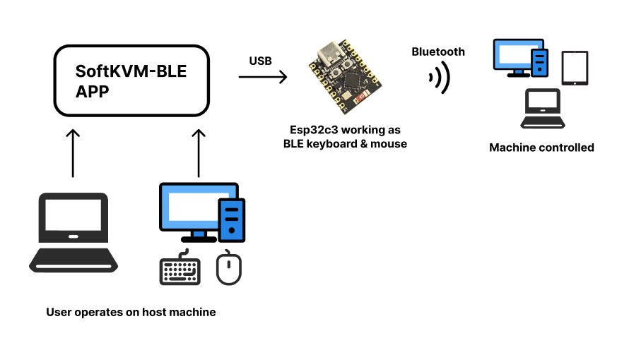
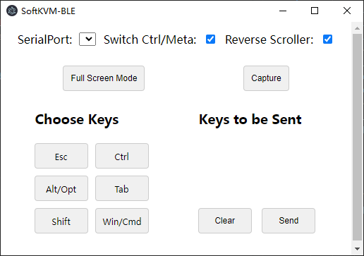

# SoftKVM-BLE

*[中文版本](README_cn.md)*

## Overview
SoftKVM-BLE is an application that enables users to control another device using keyboard and mouse inputs via Bluetooth. This app is designed to work with an ESP32 device that emulates a Bluetooth HID keyboard and mouse. [ESP32 Part](https://github.com/MotorBottle/Esp32C3-BLE-Mouse-Keyboard)

## Features
- Select and connect to available serial ports
- Send keyboard and mouse events to the connected device
- Toggle between Ctrl/Meta keys
- Invert scroll direction
- Auto-detect and connect to new serial devices when plugged in





## Prerequisites
- Node.js
- Electron
- ESP32 device configured as a Bluetooth HID keyboard and mouse. Refer to [this repository](https://github.com/MotorBottle/Esp32C3-BLE-Mouse-Keyboard) for the ESP32 setup.

## Installation
1. Clone the repository:
    ```bash
    git clone https://github.com/YourUsername/SoftKVM-BLE.git
    ```
2. Navigate to the project directory:
    ```bash
    cd SoftKVM-BLE
    ```
3. Install dependencies:
    ```bash
    npm install
    ```

## Usage
1. Start the application:
    ```bash
    npm start
    ```
2. Use the interface to select a serial port and connect.
3. Use the provided buttons to send keyboard and mouse events to the connected device.

## Interface
- **Serial Port Select**: Dropdown to select and connect to available serial ports.
- **Ctrl/Meta Toggle**: Checkbox to toggle between Ctrl and Meta keys.
- **Invert Scroll Toggle**: Checkbox to invert the scroll direction.
- **Full Screen Button**: Button to enter/exit full screen mode.
- **Capture Button**: Button to capture input for sending to the connected device.
- **Hotkey Interface**: Interface to select and send key combinations.

## Keyboard and Mouse Event Handling
- **Mouse Events**: Mouse events are captured and sent via Bluetooth to the connected device.
- **Keyboard Events**: Keyboard events are captured and sent via Bluetooth to the connected device.

## Auto-Detection of Serial Devices
The application auto-detects and connects to new serial devices when plugged in, and refreshes the list of available ports every three seconds when the pointer lock is not active.

## License
This project is licensed under the MIT License.

## Author
Motor Cheng

## ESP32 Setup
For the ESP32 setup, please refer to [this repository](https://github.com/MotorBottle/Esp32C3-BLE-Mouse-Keyboard).
