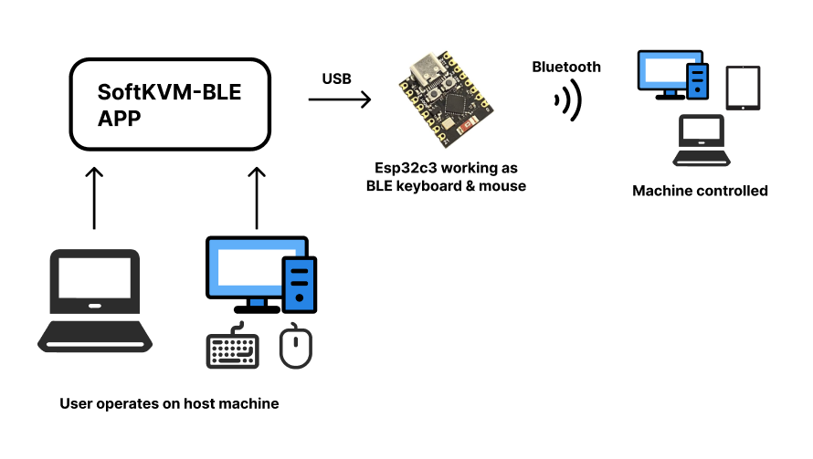

# SoftKVM-BLE

*[English](README.md)*

## 概述
SoftKVM-BLE 是一个应用程序，使用户能够通过蓝牙使用键盘和鼠标输入来控制另一台设备。此应用程序可以通过ESP32模拟蓝牙 HID 键盘和鼠标。[ESP32部分](https://github.com/MotorBottle/Esp32C3-BLE-Mouse-Keyboard)下面的连接中。

## 功能
- 选择并连接到可用的串口
- 向连接的设备发送键盘和鼠标事件
- 切换 Ctrl/Meta 键
- 反转滚动方向
- 自动检测并连接新插入的串行设备




## 前提条件
- Node.js
- Electron
- 配置为蓝牙 HID 键盘和鼠标的 ESP32 设备。请参阅 [此仓库](https://github.com/MotorBottle/Esp32C3-BLE-Mouse-Keyboard) 以获取 ESP32 设置。

## 安装
1. 克隆仓库：
    ```bash
    git clone https://github.com/MotorBottle/SoftKVM-BLE.git
    ```
2. 导航到项目目录：
    ```bash
    cd SoftKVM-BLE
    ```
3. 安装依赖项：
    ```bash
    npm install
    ```
4. 删除index.html，将index_cn.html改名为index.html

## 使用方法
1. 启动应用程序：
    ```bash
    npm start
    ```
2. 使用界面选择串口并连接。
3. 使用提供的按钮向连接的设备发送键盘和鼠标事件。

## 界面
- **串口选择**：下拉菜单选择并连接到可用的串口。
- **Ctrl/Meta 切换**：复选框切换 Ctrl 和 Meta 键。
- **反转滚动方向**：复选框反转滚动方向。
- **全屏按钮**：按钮进入/退出全屏模式。
- **捕获按钮**：按钮捕获输入以发送到连接的设备。
- **快捷键界面**：界面选择并发送组合键。

## 键盘和鼠标事件处理
- **鼠标事件**：捕获鼠标事件并通过蓝牙发送到连接的设备。
- **键盘事件**：捕获键盘事件并通过蓝牙发送到连接的设备。

## 串行设备的自动检测
当指针锁定未激活时，应用程序每三秒自动检测并连接新插入的串行设备，并刷新可用端口列表。

## 许可证
此项目根据 MIT 许可证授权。

## 作者
Motor Cheng

## ESP32 设置
有关 ESP32 设置，请参阅 [此仓库](https://github.com/MotorBottle/Esp32C3-BLE-Mouse-Keyboard)。
